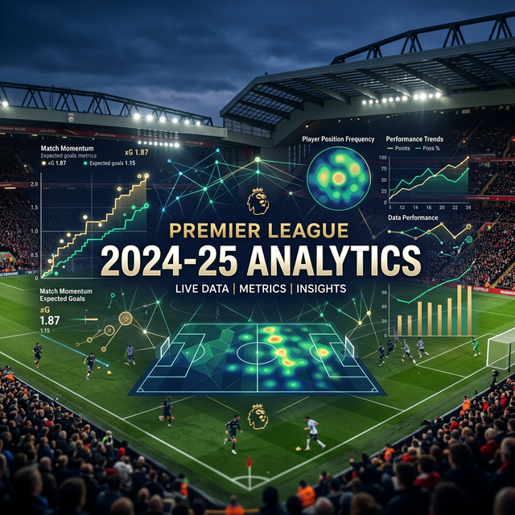

<div align="center">



# ⚽ Premier League 2024-25 EDA

[](https://www.python.org/)
[](https://github.com/)
[](LICENSE)

*Analyse approfondie de la physionomie des matchs et préparation de modèles prédictifs pour la saison 2024-25.*

[Description](#1-description-du-projet) • [Structure](#2-structure-du-projet) • [Analyses](#3-analyses-réalisées) • [Visualisations](#4-visualisations-principales) • [Next Steps](#5-prochaines-étapes) • [Installation](#6-dépendances)

</div>

---

## 1️⃣ Description du projet

Ce projet analyse les matchs de la **Premier League 2024-25** afin de comprendre la dynamique des rencontres et de préparer des modèles de prédiction robustes.

Le dataset comprend **380 matchs** avec des informations détaillées :
- 📈 **Performance offensive** : Buts marqués (domicile/extérieur), Expected Goals (xG).
- 🏟️ **Contexte du match** : Équips, dates, stades, arbitres.
- 🧪 **Objectifs** : Exploration visuelle des tendances et ingénierie de features pour la modélisation.

## 2️⃣ Structure du projet

Une organisation claire pour un flux de travail efficace :

```text
Premier-League-2024-25-EDA/
├── 📂 data/
│   ├── 📁 raw/               # Données brutes (JSON, CSV)
│   └── 📁 processed/         # Données nettoyées et prêtes pour le ML
├── 📂 notebooks/
│   └── 📓 01_EDA_matches.ipynb   # Exploration interactive
├── 📂 scripts/               # Scripts d'automatisation (nettoyage)
├── 📂 visuals/               # Graphiques et assets exportés
├── 📜 requirements.txt       # Dépendances du projet
└── 📜 README.md              # Documentation principale
```

## 3️⃣ Analyses réalisées

Nous avons mené plusieurs types d'analyses pour extraire de la valeur :
- ✅ **Qualité des données** : Nettoyage, gestion des manquants et doublons.
- 📊 **Statistiques descriptives** : Vue d'ensemble des métriques clés.
- 🔗 **Corrélations xG** : Analyse de la relation entre les buts attendus (xG) et réels.
- 📅 **Temporalité** : Analyse de la performance par jour de la semaine.
- 🏆 **Focus par Équipe** : Différence de buts, force à domicile vs extérieur.

## 4️⃣ Visualisations principales

L'analyse est supportée par des visuels puissants :
- 📉 **Distributions** : Fréquence des scores à domicile et à l'extérieur.
- 🔥 **Heatmaps** : Matrices de corrélation entre les métriques de performance.
- 📍 **Scatter Plots** : Confrontation xG vs Buts par équipe pour identifier les "overperformers".
- 🏷️ **Bar Plots** : Comparos par équipe et par période.

> [!TIP]
> Ces graphiques sont essentiels pour comprendre la "physionomie des matchs" avant d'appliquer des algorithmes de Machine Learning.

## 5️⃣ Prochaines étapes (Modélisation)

La phase suivante se concentre sur la prédiction :
- 🛠️ **Feature Engineering** : Encodage temporel, features de forme (rolling metrics).
- 🎯 **Targets** : Score exact, Résultat (1N2), Over/Under.
- 🤖 **Modèles** : Régression (Poisson pour les buts), Classification (Random Forest/XGBoost pour le résultat).

## 6️⃣ Installation et Dépendances

### Prérequis
- Python ≥ 3.10

### Installation
1. Clonez le repository
2. Installez les dépendances :
   ```bash
   pip install -r requirements.txt
   ```

---

<div align="center">
Développé avec ❤️ pour l'analyse du football.
</div>